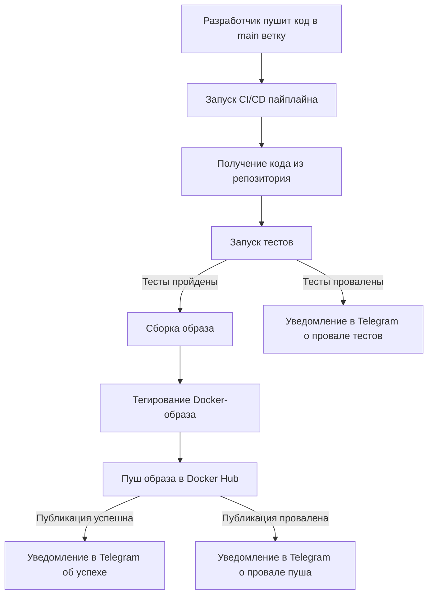

# CI/CD Pipeline Overview

```mermaid
flowchart TD
    A[Разработчик пушит код в main ветку] --> B[Запуск CI/CD пайплайна]
    B --> C[Получение кода из репозитория]
    C --> D[Запуск тестов]

    D -->|Тесты пройдены| E[Сборка образа]
    D -->|Тесты провалены| X[Уведомление в Telegram о провале тестов]

    E --> F[Тегирование Docker-образа]
    F --> G[Пуш образа в Docker Hub]

    G -->|Публикация успешна| H[Уведомление в Telegram об успехе]
    G -->|Публикация провалена| Y[Уведомление в Telegram о провале пуша]
```
